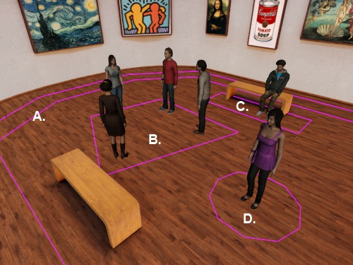

.. Author: Moritz Schubert
.. License: CC-BY

Debug Mode
==========

.. code-block:: python

    #Set debug off. Toggle debug with d key
    manager.setDebug(False)
    debugEventHandle = vizact.onkeydown('d',manager.setDebug,viz.TOGGLE)

You can switch the debug mode off and on through the ``setDebug`` method.
In debug mode the boundary of the sensors are visible which can make the finetuning of the experiment a whole lot easier.
During the actual experiment the debug mode should be deactivated.

The last line implements the feature of being able to switch debug mode off and on through pressing 'd' on the keyboard.

A New Type of Sensor
--------------------

.. code-block:: python

    #Add a sensor in the center of the room for the participant to return to after each trial
    centerSensor = vizproximity.Sensor(vizproximity.CircleArea(1.5,center=(0.0,0.0)), None)
    manager.addSensor(centerSensor)

Not much is happening here.
First we initiate an instance of the sensor class.
We will need ``centerSensor`` at the end of the learning phase to make sure that the participant is back at their starting position.
The first argument of the class determines the shape of the sensor, the other one the its position.
Passing ``None`` as the positional argument, means that the position is the default value, i.e. the world's origin at the coordinate point (0, 0, 0).

What a ``CircleArea`` sensor is, is best illustrated by a picture:

This image is taken from the Vizard documentation (source: https://docs.worldviz.com/vizard/latest/#vizproximity_sensor.htm).

A. ``PathArea``
B. ``PolygonArea``
C. ``RectangleArea``
D. ``CircleArea``

There is no upper or lower boundary to the sensors in the picture, because area sensors extend indefinitedly along the y axis.