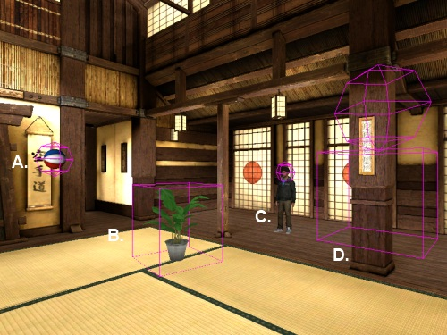

.. Author: Moritz Schubert
.. License: CC-BY

Adding the Spheres
==================

.. code-block:: python

    #fade to true color when viewpoint moves near
    def enterSphere(e, sphere, color):
        ..........
    
    #fade to white when viewpoint moves away
    def exitSphere(e, sphere):
        ..........
    
    #add spheres and create a proximity sensor around each one
    sphereSensors = []
    
    def addHiddenSphere(name, color, position):
        ..........
    
    addHiddenSphere('red', viz.RED, [0,1.8,4])
    addHiddenSphere('blue', viz.BLUE, [3.5,1.8,2])
    addHiddenSphere('yellow', viz.YELLOW, [3.5,1.8,-2])
    addHiddenSphere('green', viz.GREEN, [0,1.8,-4])
    addHiddenSphere('purple', viz.PURPLE, [-3.5,1.8,-2])
    addHiddenSphere('gray', viz.GRAY, [-3.5,1.8,2])

Staying true to our strategy of treating the defintions like black boxes until we need to look into them, we skip the two functions and go straight to the line

.. code-block:: python

    sphereSensors = []

Here, we simply initiate an empty list and assign it to the variable ``sphereSensors``.

After skipping the next function we arrive at

.. code-block:: python

    addHiddenSphere('red', viz.RED, [0,1.8,4])

Ah, seems like we need to take a look into our first black box (aka user-defined function).
So let's backtrack:

.. code-block:: python

    def addHiddenSphere(name, color, position):
    
        sphere = vizshape.addSphere(radius=0.2)
        sphere.setPosition(position)
    
        sensor = vizproximity.addBoundingSphereSensor(sphere,scale=5)
        sensor.name = name
        sphereSensors.append(sensor)
        manager.addSensor(sensor)
    
        manager.onEnter(sensor, enterSphere, sphere, color)
        manager.onExit(sensor, exitSphere, sphere)

There's quite a bit to unpack here.
First of all, the function takes three arguments, which we have called ``name``, ``color`` and ``position`` respectively.
As we can see from the uses of ``addHiddenSphere()`` directly below the function definition, ``name`` is supposed to be a string, ``color`` a ``viz`` object and ``position`` a list with three entries.

In the first line of the function, we create a sphere object using the ``addSphere`` function provided by the ``vizshape`` module.
Just like with the ``addChild()`` function above, its parent is ``viz.WORLD``.
We set its radius to 0.2 meter through the keyword argument ``radius``.
Since we don't specify a color, the color of the sphere is set to its default value, white.

In the next line we use the sphere object's method ``setPosition`` to position the sphere.
Vizard uses a three-dimensional coordinate system with an x, y and z axis.
Accordingly, we set positions with lists containing three elements, one of each axis.
In the case of the first sphere we added, the x value is 0 meters, the y value 1.8 meters and the y value 4 meters.
When the avatar "spawns" in the virtual world, it stands on top of the world origin, ``[0, 0, 0]``, and its view is paralell to the z axis.
Negative x values are to its left, positive x values to its right, negative z values behind it and positive z values in front of it; negative y values are below the ground on which the avatar stands and positive y values above it.
If you look at the video demo again (or run the script inside your demo of Vizard), you can see that the red sphere is directly in front of the participant at the start of the experiment, just as we would expect from a position with an x value of 0 and positive z value.

In the next code paragraph we add a ``BoundingsphereSensor``.
This is a sensor that is shaped like a sphere.
Scale means radius, i.e. the sphere sensor has a radius of 5 meters.

Below you can see various examples of differently shaped sensors, some of which are attached to 3D models:

aining a potted plant, shape C is a sphere which sorrounds the head of a human avatar and shape D is a composite of a cuboid on top of which a shpere was placed. The latter hovers in the air in front of a pillar.

The image is taken from the Vizard documentation (source: https://docs.worldviz.com/vizard/latest/#vizproximity_sensor.htm).
The names of the different sensors are as follows:

A. Sphere sensor
B. Box sensor
C. Sphere sensor
D. Composite sensor (box with a sphere on top of it)

The ball in the picture, object A, is very close to our experimental setup: Just imagine the ball as one of the white sphere and keep the spherical sensor around it.

In the next line, we assign the variable ``name`` (in the case of the first sphere this evaluates to ``'red'``) to the sphere's attribute ``name``. 
This gives us an easy way to identify a specific sphere, in case we want to manipulate it at a later point in the code.

Next, we append ``sensor`` to the list ``sphereSensors``.
We collect all the sensors in a list so that we can access them easily in case we want to perform some operation on all of the sensors.
For example, if we wanted to change the positions of the sensors for whatever reason, we could easily do this by iterating through the list of sensors like this:

.. code-block:: python

    for sphereSensor in sphereSensors:
        sphereSensor.setPosition(new_position)

In the last line of the paragraph we add the sensor to the manager.
This is identical to adding a target to the manager like we did above.

Managers react to target interacting with sensors based on different rules.
One of these rules is "on enter", meaning that the reaction is triggered upon a target entering a sensor.
The ``onEnter`` method of a manager instance implements this rule.
The first argument is the sensor, the second argument is the function the manager should call once any of the target enters the sensor, all of the following arguments are passed to said function.
In our case, if a target enters the ``sensor``, our ``manager`` will call the custom ``enterSphere`` function and pass to it the variables ``sphere`` and ``color`` as arguments.
We will have a look at the ``enterSphere()`` (and the corresponding ``exitSphere()`` function in the next section.

The name of the ``onExit`` method is self-explanatory and it works complementary to ``onEnter``.
In our code example, we only pass one argument after we specify which function should be called when a target exits a sensor, because said function (``exitSphere``) only takes one argument, while ``enterSphere`` takes two.

